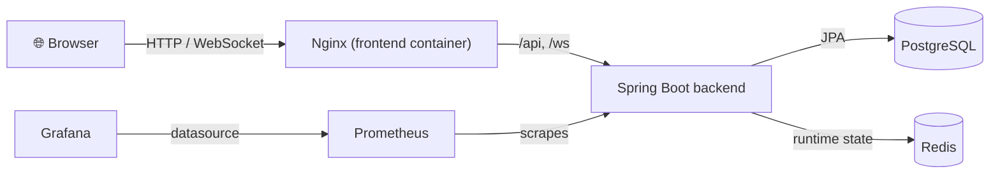

<div align="center">

# 🎵 BeatGame

**Real-time multiplayer music guessing game.**
Create a room, invite a friend, race against the clock to name the track before they do.

[](#tech-stack)
[](#tech-stack)
[](#tech-stack)
[](#tech-stack)
[](#tech-stack)
[](#tech-stack)
[](#quick-start)
[](LICENSE)

</div>

---

> 🎮 **Live demo:** [beatgame.app](https://beatgame.app) — password: `pass12345`. Screenshots coming soon.

## Table of Contents

- [Overview](#overview)
- [Features](#features)
- [Architecture](#architecture)
- [Tech Stack](#tech-stack)
- [Quick Start](#quick-start)
- [Development](#development)
- [Documentation](#documentation)
- [Reliability Notes](#reliability-notes)
- [License](#license)

## Overview

BeatGame is a real-time multiplayer music guessing game. Players create a room, invite another player, listen to short track previews, and race through rounds by choosing the correct song from a set of options. It's shipped as a full-stack Docker Compose application — Spring Boot backend, React frontend, PostgreSQL, Redis, and a Prometheus/Grafana observability stack — built to explore real-time multiplayer state, WebSocket reliability, and production-style service composition.

## Features

- 🎮 **Room-based multiplayer** — create/join flow with shareable room codes.
- 🎧 **Solo mode** for quick local play without a second player.
- ⚡ **Real-time game events** over STOMP/SockJS WebSocket topics.
- 🏆 **Round scoring, ready states, pause events**, and game-over handling.
- 🔎 **Track catalog population** from public Deezer and iTunes preview APIs.
- 🗄️ **PostgreSQL** persistence for rooms, players, and tracks.
- 🚀 **Redis-backed** runtime game state for low-latency round handling.
- 🐳 **One-command Docker Compose** stack: app, database, cache, metrics, dashboards.
- 📈 **Prometheus** scraping of Spring Boot Actuator metrics.
- 📊 **Provisioned Grafana** datasource and JVM/Spring Boot dashboard out of the box.

## Architecture



The backend owns room lifecycle, player registration, game rounds, scoring, the track catalog, and WebSocket event handling. PostgreSQL stores durable entities (rooms, players, tracks); Redis holds active game state, scores, readiness, and disconnected-player markers. The frontend is a React/Vite SPA that drives room creation, lobby configuration, gameplay, audio playback, and result screens.

See [docs/ARCHITECTURE.md](docs/ARCHITECTURE.md) for the full package-level breakdown and WebSocket destination map.

## Tech Stack

| Layer | Stack |
|---|---|
| **Backend** | Java 21 · Spring Boot 3.2 · Spring WebSocket · Spring Data JPA · Redis · Flyway · Micrometer |
| **Frontend** | React 18 · TypeScript · Vite · Zustand · STOMP.js · SockJS · Howler |
| **Infrastructure** | Docker Compose · PostgreSQL 16 · Redis 7 · Nginx · Prometheus · Grafana OSS |
| **Testing** | JUnit 5 · Spring Boot Test · Testcontainers |

## Quick Start

**Requirements:** Docker and Docker Compose, plus internet access on first run so the track catalog can be populated from public APIs.

1. Create a local environment file:

   ```powershell
   Copy-Item .env.example .env
   ```

2. Edit `.env` and set at least these values:

   ```dotenv
   POSTGRES_DB=beatgame
   POSTGRES_USER=beatgame
   POSTGRES_PASSWORD=change-me
   DEEZER_API_BASE_URL=https://api.deezer.com
   ITUNES_API_BASE_URL=https://itunes.apple.com
   ALLOWED_ORIGINS=http://localhost,http://localhost:5173
   ADMIN_TOKEN=change-me
   GRAFANA_ADMIN_USER=admin
   GRAFANA_ADMIN_PASSWORD=change-me
   VITE_ACCESS_PASSWORD=
   ```

3. Start the full stack:

   ```powershell
   docker compose up -d --build
   ```

4. Open:

   | Service | URL |
   |---|---|
   | App | http://localhost |
   | Grafana | http://127.0.0.1:3000 |
   | Backend health (inside Compose network) | `http://backend:8080/actuator/health` |

Stop the stack:

```powershell
docker compose down
```

Remove local volumes for a clean database/cache/dashboard state:

```powershell
docker compose down -v
```

## Development

**Backend:**

```powershell
cd beatgame-backend
mvn test
```

**Frontend:**

```powershell
cd beatgame-frontend
npm ci
npm run build
```

For local frontend development, Vite proxies `/api` and `/ws` to the backend according to `beatgame-frontend/vite.config.ts`.

## Documentation

| Doc | Description |
|---|---|
| [Architecture](docs/ARCHITECTURE.md) | Backend/frontend structure, WebSocket destination map, runtime infra |
| [Local Development](docs/LOCAL_DEVELOPMENT.md) | Running the stack locally outside Docker |
| [AWS Deployment](docs/AWS_DEPLOYMENT.md) | How the live demo runs, and how a commit gets there |
| [Observability](docs/OBSERVABILITY.md) | Prometheus metrics and Grafana dashboards |
| [WebSocket Reliability](docs/WEBSOCKET_RELIABILITY.md) | Reconnect behavior, disconnect handling, known limits |
| [Security Notes](docs/SECURITY.md) | Security-relevant configuration and assumptions |

## Reliability Notes

The application supports client WebSocket reconnects through STOMP.js and a 60-second server-side multiplayer rejoin window. Server restart recovery is intentionally limited in the current version because active round timers live in process memory. See [WebSocket Reliability](docs/WEBSOCKET_RELIABILITY.md) for the exact behavior and recommended next steps.

## License

Released under the [MIT License](LICENSE).
