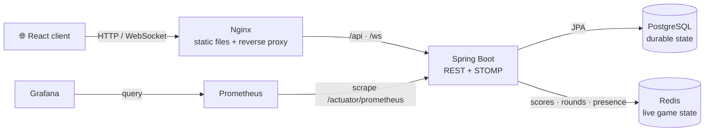
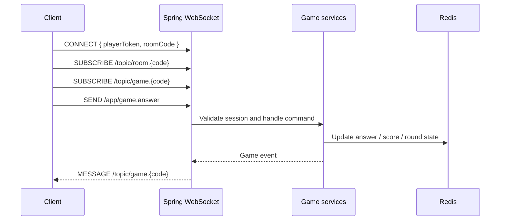

# 🧭 Architecture

> How BeatGame moves data from the browser to the game engine, persistence layer, and observability stack.

[← Back to README](../README.md) · [Local development](LOCAL_DEVELOPMENT.md) · [WebSocket reliability](WEBSOCKET_RELIABILITY.md)

## System at a glance

BeatGame is a small distributed system packaged as one Docker Compose stack. Nginx serves the React application and provides a single entry point for REST and WebSocket traffic; Spring Boot owns the game rules and coordinates durable and transient state.

## Responsibility map

| Layer | Owns | Key technology |
|---|---|---|
| Browser | Navigation, lobby UI, audio playback, local game state | React, TypeScript, Zustand |
| Edge | SPA delivery and API/WebSocket proxying | Nginx |
| Application | Rooms, players, rounds, scoring, catalog and events | Spring Boot |
| Durable storage | Rooms, players and track catalog | PostgreSQL, Flyway |
| Runtime storage | Active game state, scores, readiness and disconnect markers | Redis |
| Telemetry | Metrics collection and dashboards | Actuator, Prometheus, Grafana |

## Backend map

The backend is organized by domain rather than by technical layer:

| Package | Responsibility |
|---|---|
| `com.beatgame.room` | Room creation, joining, status and cleanup |
| `com.beatgame.player` | Player records and player tokens |
| `com.beatgame.game` | Round orchestration, scoring and Redis-backed state |
| `com.beatgame.track` | Catalog, genres, decades, providers and preview resolution |
| `com.beatgame.websocket` | STOMP endpoint, inbound session context and game events |
| `com.beatgame.config` | Redis, REST clients, rate limiting and application wiring |

> **Storage boundary:** PostgreSQL holds data that should outlive a game process. Redis holds state that must be fast during a live match. Some round timers still live in the Java process; see [WebSocket reliability](WEBSOCKET_RELIABILITY.md#server-restart).

## Frontend map

| Area | Role |
|---|---|
| `src/pages` | Home, lobby, solo configuration, gameplay and results |
| `src/components` | Reusable game UI such as timer, scoreboard and audio player |
| `src/hooks/useWebSocket.ts` | STOMP/SockJS lifecycle, subscriptions and event publishing |
| `src/store/useGameStore.ts` | Client-side game state and player identity |
| `src/types` | REST and WebSocket payload shapes |

## Real-time message flow

Clients publish commands below `/app`—for example `game.start`, `game.answer`, `game.ready`, `game.rejoin`, `room.config`, and `game.pause`. The server broadcasts room and game updates on room-scoped `/topic` destinations.

## Deployment shape

Docker Compose starts six services: `frontend`, `backend`, `postgres`, `redis`, `prometheus`, and `grafana`. Only the frontend and loopback-bound Grafana port are published by default; the remaining services communicate on the internal Docker network.

For startup instructions, configuration values, and useful commands, continue with [Local development](LOCAL_DEVELOPMENT.md).
