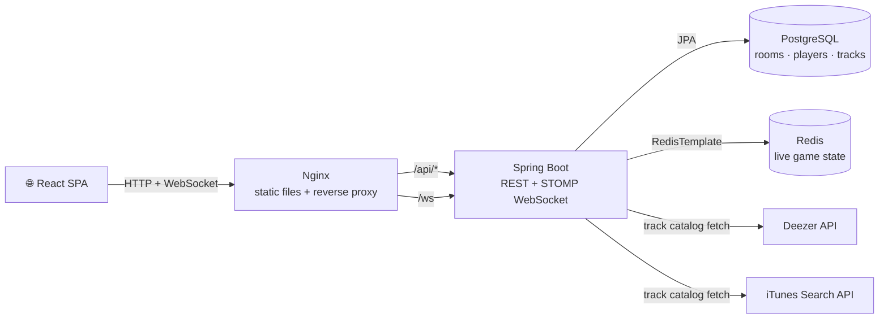

# Architecture

BeatGame is a real-time, two-player (or solo) music-guessing game: players listen to a short track preview and race to pick the correct title and artist from a set of options before the round timer runs out. This doc covers how the running system is put together — not the code layout in exhaustive detail, just enough to understand the shape of it.

## Components

| Component | Stack | Role |
|---|---|---|
| Backend | Spring Boot 3 / Java 21 | REST API, STOMP WebSocket server, game logic, persistence, track catalog |
| Frontend | React 18 / TypeScript / Vite | Single-page app: room UI, gameplay screen, WebSocket client, audio playback |
| Nginx | bundled with the frontend image | Serves the built SPA, reverse-proxies `/api` and `/ws` to the backend |
| PostgreSQL | `postgres:16` | Durable storage — rooms, players, tracks, game session history |
| Redis | `redis:7-alpine` | Live game state — current round, scores, readiness, disconnect markers, preview-URL cache |
| Deezer API / iTunes Search API | third-party | Track metadata and 30-second preview audio |
| Prometheus + Grafana | local Docker Compose only | Metrics scraping and dashboards for local development; not part of the production stack |

## Backend shape

The backend is organized by domain, not by technical layer — there's no repo-wide `controller`/`service`/`repository` split. Each feature area (`game`, `room`, `player`, `track`, `websocket`, `auth`) owns its own entities, services, and (where relevant) REST or STOMP handlers. A small `config` package supplies shared infrastructure beans — the Redis client, the HTTP clients used to call Deezer/iTunes, the scheduled-task executor behind round timers.

## State: Postgres for identity, Redis for gameplay

Two different kinds of state exist, and they're stored differently on purpose. **Postgres holds identity that has to survive** — rooms, players, and the track catalog itself are durable records; a room still exists if the backend restarts mid-game. **Redis holds the game while it's actually being played** — current round, scores, readiness, disconnect timers, a short-lived preview-URL cache. Postgres never sees a write mid-round; every round's read/write traffic hits Redis only. Round timers are JVM-local, but active timers are re-armed after a restart from timestamps stored in Redis. See [Design Decisions](DESIGN_DECISIONS.md) for why it's split this way.

## Real-time protocol, at a glance

The frontend and backend talk over two channels:
- **REST** for one-shot actions — create a room, join a room, look up genres/decades.
- **STOMP over WebSocket** (via SockJS) for the game itself — round start, answer submission, round results, game over. Clients subscribe to `/topic/room.{code}` and `/topic/game.{code}` for their room; the server pushes every update, nobody polls.

WebSocket was the natural fit here over polling: both players need to see the round timer, the opponent's readiness, and the round result within the same second it happens, and a poll-based client would either lag behind or hammer the server to stay current. A single persistent connection per player does that for free.

## What this system doesn't do

No user accounts, no persistent player history across sessions, no payments, no content hosting — track audio is streamed from third-party preview URLs, never stored by this system. Player identity is a short-lived guest credential (see [Design Decisions](DESIGN_DECISIONS.md)), good for one browser session.
