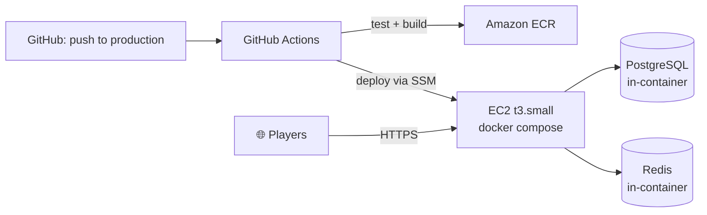

# ☁️ AWS Deployment

> How the live demo at [beatgame.app](https://beatgame.app) actually runs, and how a change gets from a commit to that URL.

[← Back to README](../README.md) · [Architecture](ARCHITECTURE.md) · [Security](SECURITY.md)

## Live

**https://beatgame.app** — password: `pass12345` (a casual gate, not real access control — see [Security Notes](SECURITY.md)).

## Shape of the deployment

A single EC2 instance runs the same Docker Compose shape as local development — nginx, backend, PostgreSQL, and Redis, all in containers — fronted by a real domain and a Let's Encrypt certificate. That's a deliberate choice, not an oversight: this app doesn't yet have the multi-instance coordination (external STOMP broker, externalized round timers) that would make a managed, horizontally-scaled setup (ECS/Fargate, RDS, ElastiCache) actually pay for itself. See [WebSocket Reliability](WEBSOCKET_RELIABILITY.md#server-restart) for why that matters. One honest box beats a distributed system this app can't yet take advantage of.

## What's automated

| Stage | What happens |
|---|---|
| Push to `main` | Backend tests (JUnit + Testcontainers) and frontend build run on every push. Nothing deploys. |
| Push/merge to `production` | Same tests, plus: Docker images built and pushed to a private ECR registry, then deployed to the EC2 host. |
| Deploy step | Runs over **AWS Systems Manager Session Manager**, not SSH — commands execute through the AWS API using the same identity the build step already has, so no inbound SSH port has to be open to CI at all. |

`main` is where day-to-day work happens; `production` is what's actually live. Nothing reaches the running server without going through the test suite first.

## Identity, not long-lived keys

GitHub Actions authenticates to AWS via **OIDC** — a short-lived, per-run credential issued directly by AWS, not a static access key sitting in a repo secret. Separately, the EC2 instance has its own IAM role for pulling images from ECR and writing backups; it never needs credentials handed to it manually.

## Cost shape

This runs on a small instance sized for portfolio traffic, not production scale — roughly the cost of a couple of streaming subscriptions per month. It's built to be paused (stopped, not destroyed) between uses without losing data, since a Docker volume doesn't care whether the EC2 instance under it is running.

## What this deployment deliberately doesn't have (yet)

- Managed database/cache (RDS, ElastiCache) — self-managed containers are fine at this scale and this traffic pattern.
- Horizontal scaling / load balancing — blocked on the same in-memory STOMP broker limitation noted in [WebSocket Reliability](WEBSOCKET_RELIABILITY.md).
- Centralized log aggregation beyond container-local logs.

None of these are unknown gaps — they're the next things on the list once there's an actual reason to need them, not before.
