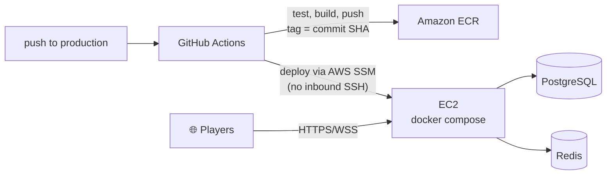

# Deployment

BeatGame runs live at a real domain over HTTPS, deployed through the same GitHub Actions pipeline on every push to `production`.

## Shape

One EC2 instance runs the full stack via Docker Compose — PostgreSQL, Redis, the Spring Boot backend, and an Nginx container that terminates TLS and reverse-proxies everything else. This is a deliberate portfolio-scale choice: the point was to demonstrate a real, working cloud deployment end-to-end (infra-as-code, CI/CD, TLS, a real domain) without the operational overhead of a managed-service fleet a side project doesn't need. The architecture doesn't assume single-instance forever — see [Architecture](ARCHITECTURE.md) for how state is already split between a durable store and an ephemeral one, which is the part that would need to change first for horizontal scaling.

## CI/CD

A few things worth calling out about this pipeline specifically:

- **No long-lived AWS credentials in the repo.** GitHub Actions authenticates to AWS via OIDC — it assumes a role scoped to this repository, nothing is stored as a static access key.
- **No inbound SSH required for deploys.** The pipeline pushes the new container images to ECR, then triggers the deploy on the EC2 host through AWS Systems Manager Session Manager — no port needs to be open for CI to reach the instance.
- **Tests gate the build.** Backend and frontend test suites run first; the Docker images are only built and pushed if both pass.

See [Design Decisions](DESIGN_DECISIONS.md) for more on why these specific choices were made.

## Domain & TLS

The app is served from a real, registered domain with a Let's Encrypt certificate, with DNS managed through Route53. Infrastructure (the EC2 instance, networking, DNS, the container registry, the CI role) is all defined as Terraform, not clicked together by hand.

## What's intentionally out of scope right now

No managed database, no load balancer, no staging environment, no multi-instance deployment — see the root [README](../README.md)'s Current Limitations for the specifics. These are scale decisions, not gaps discovered by accident: a single well-understood instance was the right size for what this project needed to demonstrate.
