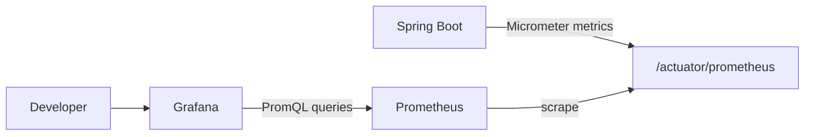

# 📈 Observability

> A ready-to-run metrics pipeline for local debugging and portfolio demos.

[← Back to README](../README.md) · [Architecture](ARCHITECTURE.md) · [Security](SECURITY.md)

## Data path



| Component | Responsibility |
|---|---|
| Spring Boot Actuator | Exposes health and application metrics |
| Micrometer | Converts JVM/Spring measurements to Prometheus format |
| Prometheus | Periodically scrapes and stores time-series data |
| Grafana | Visualizes metrics through a provisioned dashboard |

## Start the stack

Set local Grafana credentials in `.env`:

```dotenv
GRAFANA_ADMIN_USER=admin
GRAFANA_ADMIN_PASSWORD=change-me
```

Then start the application:

```powershell
docker compose up -d --build
docker compose ps
```

Open Grafana at http://127.0.0.1:3000. The Prometheus datasource and JVM/Spring Boot dashboard are provisioned automatically—no UI setup is required.

## What to look at

The included dashboard is useful for demonstrating and diagnosing:

- JVM memory and garbage collection behavior
- HTTP request volume and latency
- thread and process activity
- Spring Boot application health
- runtime changes while rooms and games are active

## Configuration map

| File | Purpose |
|---|---|
| `observability/prometheus.yml` | Backend scrape target and interval |
| `observability/grafana/provisioning/datasources/prometheus.yml` | Prometheus datasource |
| `observability/grafana/provisioning/dashboards/dashboard.yml` | Dashboard provider |
| `observability/grafana/provisioning/dashboards/jvm-spring-boot.json` | Prebuilt dashboard definition |

## Useful checks

```powershell
# Inspect Prometheus and Grafana health
docker compose ps prometheus grafana

# Follow collection or provisioning logs
docker compose logs -f prometheus
docker compose logs -f grafana
```

> **Local-first default:** Grafana is published on `127.0.0.1:3000`, while Prometheus stays on the internal Docker network. Before using this stack in a shared environment, rotate credentials, add TLS/authentication at the edge, and review every published port.
