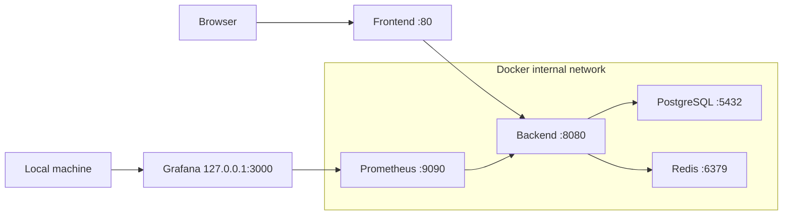

# 🔐 Security Notes

> Security boundaries, safe defaults, and known limitations of the portfolio deployment.

[← Back to README](../README.md) · [Architecture](ARCHITECTURE.md) · [WebSocket reliability](WEBSOCKET_RELIABILITY.md)

## Security posture

BeatGame is a portfolio/demo application, not a production authentication platform. It still follows useful deployment hygiene: secrets stay outside Git, infrastructure services use an internal network, and administrative catalog operations can be disabled.

| Area | Current approach | Production consideration |
|---|---|---|
| Secrets | Local `.env` or deployment environment | Use a managed secret store and rotation |
| Player identity | Random room/player tokens | Add real accounts and authorization if required |
| Admin operations | Optional `X-Admin-Token` | Use authenticated roles and audit logging |
| Abuse control | Backend rate-limit filter | Move enforcement to a shared gateway/store when scaling |
| Transport | Local HTTP by default | Terminate HTTPS/WSS at a trusted reverse proxy |
| Third-party media | Public preview URLs | Validate policy, availability, and content requirements |

## Secrets and configuration

Never commit `.env` files. Start from `.env.example` and provide real values locally or through deployment secrets.

Values that must be reviewed outside local development:

- `POSTGRES_PASSWORD`
- `ADMIN_TOKEN`
- `JWT_SECRET`
- `GRAFANA_ADMIN_PASSWORD`
- any future API keys, signing keys, or OAuth credentials

> **Important:** `VITE_*` variables are compiled into browser assets. `VITE_ACCESS_PASSWORD` is only a lightweight demo gate and must not be treated as server-side access control.

When `ADMIN_TOKEN` is blank, the track population endpoints reject requests. Do not use placeholder values such as `change-me` in a public deployment.

## Network boundary

Only the frontend and loopback-bound Grafana port are published by the default Compose file. PostgreSQL, Redis, Prometheus, and the backend remain reachable only inside the Compose network.

## Application-level notes

- WebSocket clients identify themselves with room and player tokens, not user accounts.
- Tokens are capabilities: anyone who obtains a valid token may act as that player during its lifetime.
- Rate limiting is implemented by the backend filter layer and is local to the application instance.
- Deezer and iTunes preview URLs are third-party content and should be treated as untrusted external resources.
- CORS origins are configured through `ALLOWED_ORIGINS`; public deployments should use an explicit allowlist.

## Before exposing publicly

- [ ] Replace all placeholder credentials.
- [ ] Serve the app through HTTPS/WSS.
- [ ] Restrict `ALLOWED_ORIGINS` to the deployed frontend.
- [ ] Decide whether administrative catalog endpoints should be enabled.
- [ ] Protect or remove operational endpoints that do not need public access.
- [ ] Review logs so player tokens and sensitive headers are not retained unnecessarily.
- [ ] Add dependency, container, and secret scanning to CI.

For reconnect behavior and token persistence tradeoffs, see [WebSocket reliability](WEBSOCKET_RELIABILITY.md).
