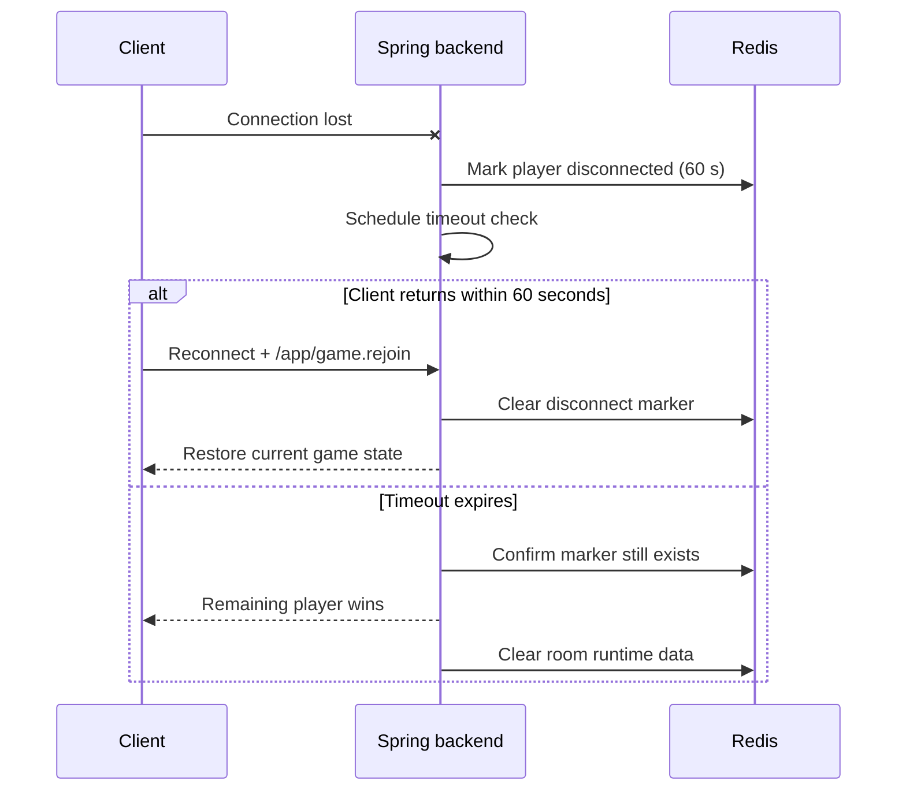

# 🔌 WebSocket Reliability

> What happens when a client disconnects, reconnects, reloads, or encounters a backend restart.

[← Back to README](../README.md) · [Architecture](ARCHITECTURE.md) · [Security](SECURITY.md)

## Reliability snapshot

| Scenario | Current behavior | Confidence |
|---|---|---|
| Short network interruption | STOMP retries every 5 seconds | Supported |
| Multiplayer rejoin within 60 seconds | Server keeps a Redis disconnect marker and restores state | Supported path |
| Disconnect beyond 60 seconds | Remaining player wins; runtime room data is cleared | Supported |
| Solo disconnect | Runtime game data is cleared immediately | Supported |
| Full page reload | Recovery depends on locally retained room/player context | Partial |
| Backend restart mid-round | Clients reconnect, but round continuity is not guaranteed | Limited |
| Multi-instance backend | In-memory broker and timers are not coordinated | Not supported |

## Connection model

The React client uses SockJS and STOMP.js through `src/hooks/useWebSocket.ts`. It connects to `${VITE_API_BASE_URL}/ws`—or `/ws` when the base URL is empty—and sends `playerToken` plus `roomCode` as STOMP connection headers.

After connecting, it subscribes to:

- `/topic/room.{roomCode}` for lobby and room state
- `/topic/game.{roomCode}` for rounds, scores, pauses, and game-over events

The backend exposes `/ws`, accepts commands under `/app`, and uses Spring's simple in-memory broker for `/topic` destinations. `AuthChannelInterceptor` attaches the connection headers to the WebSocket session.

## Multiplayer disconnect timeline

For a solo room, disconnect handling clears Redis game data immediately. Sending a game-over event would not help because the only subscribed client is already gone.

## Page reload and browser reopen

The frontend keeps most game state in its client store. A reconnect publishes `/app/game.rejoin` only when the local phase is neither `home` nor `lobby`.

This creates an important distinction:

- a brief network drop while the page stays open has a recovery path;
- a full reload may lose enough in-memory context to prevent automatic recovery;
- authoritative room/game data may still exist in PostgreSQL and Redis, but the client needs a snapshot mechanism to rediscover it.

## Server restart

| Survives | Does not fully survive |
|---|---|
| PostgreSQL data and volume | Java timers and scheduled round work |
| Redis data while its container/volume remains | In-memory STOMP subscriptions and broker state |
| Durable room/player/track records | Guaranteed continuation at the exact round deadline |

After a backend restart, clients can attempt to reconnect, but full mid-round continuation is not guaranteed. Reliable recovery would require persisted deadlines and an authoritative state snapshot rather than relying on process-local timers.

## Heartbeats and retry strategy

The client currently uses a fixed `reconnectDelay` of 5 seconds. Explicit application heartbeat intervals, exponential backoff, and jitter are not configured.

That is adequate for a small demo, but at larger scale synchronized retries can create a reconnect spike. Heartbeats would also make dead-connection detection more predictable.

## Improvement roadmap

1. Configure explicit STOMP heartbeats on client and server.
2. Replace fixed retry timing with exponential backoff plus jitter.
3. Persist resumable round data: round id, start time, deadline, track, options, answers, and scores.
4. Add a REST or WebSocket snapshot endpoint for authoritative recovery.
5. Persist the player token and room code through a deliberate, reviewed client mechanism.
6. Add integration tests for reconnect before/after timeout and backend restart.
7. Move to an external broker and coordinated scheduling before running multiple backend instances.

> The current behavior is intentionally documented rather than hidden: the reconnect window works for the portfolio use case, while restart-safe rounds and horizontal scaling remain clear next steps.
